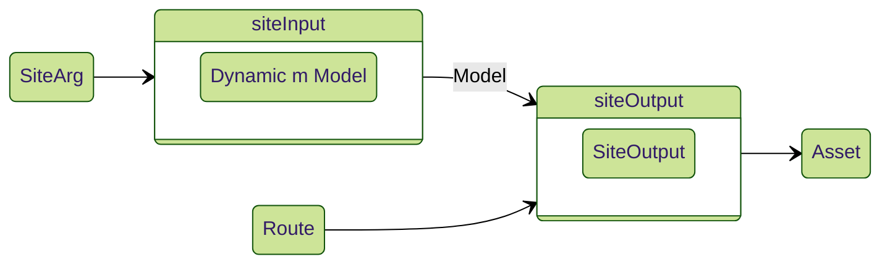

# EmaSite

The `EmaSite` typeclass "orchestrates" and ties-together the whole site pipeline. The instance is written on the top-level site [[route]], which in turn enables using the `Ema.runSite` function to run the site from `main` entrypoint of your Haskell project.

## `SiteArg`

The `SiteArg` type specifies the options required to run the site. Typically these come from command line arguments and other environment. The value of this type is passed to the `siteInput` method of the `EmaSite` typeclass, as well as taken by the `Ema.runSite` function (which is called from `main`).

`SiteArg` is `()` by default (meaning, it is unused).

## `siteInput`

The `siteInput` method takes a `SiteArg` value (and other relevant parameters) and returns a [[dynamic]] of the site's [[model]].

## `siteOutput`

The `siteOutput` method takes the [[model]] value snapshot at that point in time, as well as the route value to render and returns a [[asset]] output (typically HTML bytestring) for it. `siteOutput` has IO capabilities; however, it typically is defined as a pure function (`siteOutput ... = pure <expr>`) inasmuch as all the data required to render the site is contained in the [[model]].

Note that this method may return a non-`Asset` type as well (as specified by `SiteOutput` type). This can be useful in sub-sites that are [[compose|composed]] manually at the top-level.